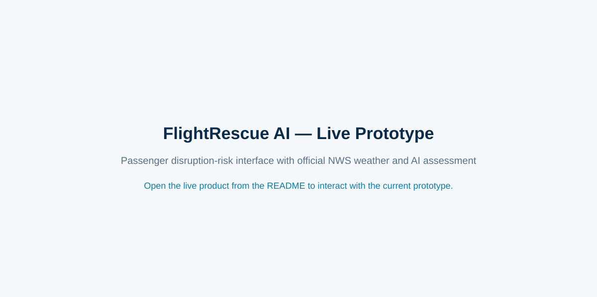

<p align="center">
  
</p>

<h1 align="center">FlightRescue AI — End-to-End Flight Disruption Intelligence</h1>

<p align="center">
  <strong>From public aviation and weather data to a trained AI model, live API, and passenger-facing product.</strong>
</p>

<p align="center">
  <a href="https://nadia-mas.github.io/flight-disruption-ai/"><strong>✈️ Launch the Live FlightRescue AI Product</strong></a>
</p>

<p align="center">
  <a href="https://nadia-mas.github.io/flight-disruption-ai/">
    
  </a>
</p>

> **Current status:** FlightRescue is a deployed **experimental research prototype**. The complete end-to-end engineering pipeline is functional, while the AI models are actively being improved, calibrated, and expanded to use weather at both ends of selected routes.

## Why FlightRescue was built

FlightRescue was motivated by the passenger uncertainty experienced during **Hurricane / Tropical Storm Lala in Hawaii in August 2026**. During a major weather disruption, travelers can see weather warnings and airline status pages, but those sources do not directly answer the questions a stranded passenger naturally asks:

- What is the chance that **my flight** will be disrupted?
- What happened when similar weather affected Maui before?
- How often did my airline delay or cancel flights during comparable events?
- How did other airlines perform under the same conditions?
- How long did airport operations take to recover?

FlightRescue connects those questions to historical aviation data, official weather information, machine learning, and historical-event evidence.

## Passenger persona

### Maya — a passenger trying to get home from Maui

Maya is a leisure traveler whose Maui vacation is ending during a major Hawaii weather event. Her flight is scheduled between **Kahului (OGG)** and **Los Angeles (LAX)** or **Dallas/Fort Worth (DFW)**. Her airline has already changed schedules, and she wants to understand whether another delay or cancellation is likely.

Maya is not an aviation or meteorology expert. She should only need to enter her **airline, origin, destination, date, and scheduled time**. FlightRescue retrieves and interprets the technical information behind the scenes.

## What the product provides

FlightRescue combines:

- passenger flight details;
- official National Weather Service forecast information;
- historical BTS airline operations;
- NOAA weather and severe-weather data;
- a trained flight-disruption model;
- a two-stage severe-disruption model;
- historical similar-event retrieval;
- airline-specific delay and cancellation evidence;
- recovery context; and
- a passenger-friendly web interface.

The product deliberately keeps **AI predictions** and **historical evidence** separate. Historical percentages are not presented as future guarantees, and model probabilities are not presented as known flight outcomes.

## End-to-end AI / data science architecture

```text
Raw BTS + NOAA historical data
            ↓
Cleaning + temporal alignment + feature engineering
            ↓
Time-aware train / validation / held-out test sets
            ↓
Disruption + severe-disruption AI models
            ↓
Model artifacts + calibration / validation
            ↓
FastAPI inference service on Vercel
            ↓
Official NWS forecast at prediction time
            +
Historical event similarity + airline behavior
            ↓
Passenger-facing FlightRescue assessment
            ↓
GitHub Pages web application
```

This makes FlightRescue an **end-to-end project**, covering data acquisition, data engineering, exploratory analysis, feature engineering, machine learning, validation, inference, API engineering, frontend development, cloud deployment, CI workflows, and production smoke testing.

## AI model

The backend currently estimates:

1. **Any disruption probability** — the estimated risk of delay, cancellation, diversion, or related operational disruption.
2. **Severe disruption probability** — implemented with a two-stage severe-risk architecture so severe risk remains logically bounded by overall disruption risk.

The current production model uses flight, airline, route/direction, schedule/calendar, and weather features. The model is useful as a research prototype, but **prediction quality is still an active research problem**. Current work focuses on probability calibration, rare severe-event prediction, route sensitivity, airline sensitivity, and whether displayed probabilities correspond to observed historical frequencies.

## Weather intelligence and v3

Passengers are not asked to manually enter technical weather measurements. FlightRescue retrieves official **National Weather Service (NWS)** forecast information near the relevant scheduled flight time.

The original production model is OGG-centric. **FlightRescue v3 is being developed to use weather at both ends of the flight** for a deliberately focused route set:

- OGG → LAX
- LAX → OGG
- OGG → DFW
- DFW → OGG

The v3 design separates origin and destination weather features and will be promoted to production only after held-out validation and calibration checks.

## Historical airline intelligence

For comparable historical hazardous-weather windows, FlightRescue can summarize airline behavior using metrics such as:

- flights observed;
- percentage delayed by at least 15 minutes;
- cancellation percentage;
- severe-disruption percentage;
- mean delay; and
- selected-airline versus other-airline performance.

The objective is to provide evidence for questions such as: **“During similar historical conditions, how did American Airlines perform at OGG compared with other airlines?”**

## Technology stack

**Data science / ML:** Python, pandas, NumPy, scikit-learn, joblib  
**Data:** U.S. DOT/BTS flight operations, NOAA Local Climatological Data, NOAA Storm Events  
**Live weather:** National Weather Service  
**Backend:** FastAPI  
**Deployment:** Vercel + GitHub Pages  
**MLOps:** GitHub Actions, versioned model artifacts, temporal validation, automated smoke tests

## Research pipeline

The original OGG workflow contains nine notebook stages covering source exploration, EDA, modeling-table construction, leakage-controlled feature engineering, baseline modeling, binary/severe modeling, recovery analysis, historical-event retrieval, and passenger-facing inference integration.

Production scripts extend the notebook research into reproducible model artifacts, airline-event aggregation, live inference, smoke testing, calibration work, and v3 dual-airport modeling.

## Repository structure

- `api/` — Vercel serverless entry point
- `backend/` — FastAPI backend
- `data/raw/` — downloaded/generated source data
- `data/processed/` — model-ready and production evidence artifacts
- `docs/` — public passenger frontend and visual assets
- `models/` — trained inference artifacts
- `notebooks/` — research notebooks
- `scripts/` — data, model, aggregation, testing, and v3 workflows
- `src/` — preprocessing, features, modeling, retrieval, and FlightRescue services
- `tests/` — automated tests
- `.github/workflows/` — CI/model/deployment workflows

## Live product

**FlightRescue AI:** https://nadia-mas.github.io/flight-disruption-ai/

The frontend is hosted with GitHub Pages and calls the separately deployed FastAPI inference service for live model predictions and weather-aware scenario analysis.

## API usage and permission

The FlightRescue API is provided for **research, demonstration, and evaluation purposes**. Third-party use — including integration into another website/application, automated access, redistribution, commercial use, or use as part of another service — requires **prior permission from the project owner**.

**Fatemeh (Nadia) Masoumi**  
**Email:** Fatemeh.masoumi.1994@gmail.com

Public availability of an endpoint should not be interpreted as permission for unrestricted third-party API use.

## Research-use notice

FlightRescue is an **experimental research decision-support system** and is not an official airline, airport, FAA, NOAA, or National Weather Service product. Predictions and historical comparisons are informational and are not guarantees of future flight status. Travelers should confirm operational decisions with their airline and official aviation/weather sources.

---

<p align="center">
  <a href="https://nadia-mas.github.io/flight-disruption-ai/"><strong>Open FlightRescue AI →</strong></a>
</p>
